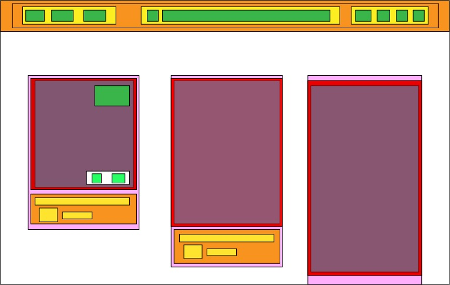
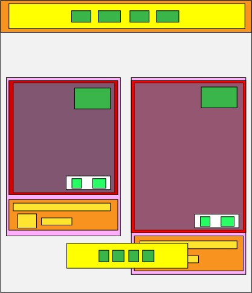

# Componentes

Header Layout: es el componente que contiene todos mis header sea mobile o web
Head: El head tiene un contenedor en el que se divide en tres contenedores que se dividen por espacio de izquierda, medio, y derecha, éstos contenedores se usan con el fin de poder aplicarles estilos y propiedades para que esten estaticos o responsive a la hora de hacer la ventana en ultra wide o tablet; y ya cada boton en su respectivo lugar
Mobile:En movile tiene dos div, uno para el header y otro para el footer, y ya de estos entran sus botones
Pinterest Layout: es el componente en el que se aplica el grid para acomodar los pincard, e ingresa las imagenes
Pincard: El pincard tiene un contenedor principal que contiene todo, despues tiene otro contenedor adentro del tamaño de la imagen lo que nos ayuda adentro a acomodar los botones de los cuales el superior no tiene div, pero los dos inferiores si tienen un div que los contiene. Saliendo del hover, tenemos un contenedor en el que se acomoda la descripcion de la imagen, la imagen del usuario y su nombre

# Archivo extra

se hizo un archivo useWindowSize.js que su fucion es capturar el tamaño de la ventana para poder activar el responsive de mobile
